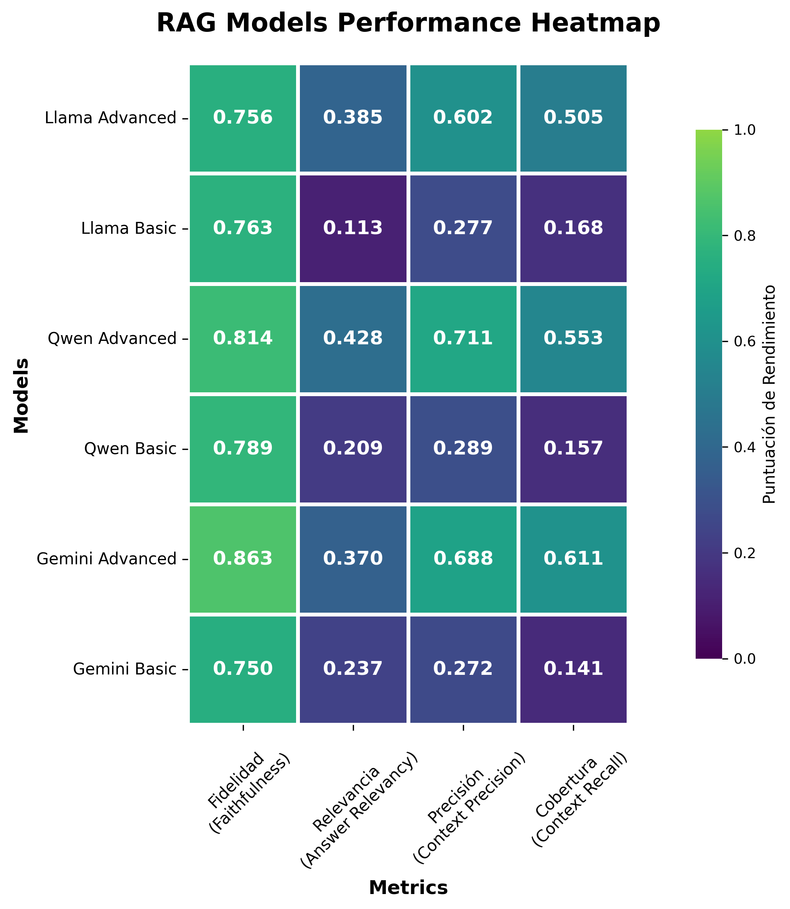

# Análisis y Evaluación Comparativa de Pipelines RAG

Este proyecto ofrece un framework completo para implementar, evaluar y comparar el rendimiento de diferentes pipelines de Retrieval-Augmented Generation (RAG). Se utilizan varios modelos de lenguaje (LLMs) y estrategias de chunking para analizar cómo cada componente afecta la calidad de las respuestas generadas.

## ✨ Características Principales

- **Evaluación de Múltiples LLMs**: Compara el rendimiento de modelos como Gemini, llama y Qwen.
- **Estrategias de RAG Avanzadas**: Implementación desde un sistema RAG simple hasta configuraciones más complejas y optimizadas.
- **Vector Store con ChromaDB**: Utiliza ChromaDB para la gestión eficiente de embeddings vectoriales.
- **Notebooks Detallados**: El proceso de evaluación está documentado paso a paso en Jupyter Notebooks.
- **Resultados Cuantificables**: Genera datasets de evaluación y reportes en CSV para un análisis objetivo.

## 📊 Visualización de Resultados

A continuación, se muestra un heatmap que resume el rendimiento comparativo de los modelos evaluados en las distintas configuraciones de RAG.



## 📂 Estructura del Proyecto

```
.
├── data/
│   └── Documentos fuente para el proceso RAG (PDFs, etc.).
├── nuevo_rag/
│   └── Entorno virtual de Python con las dependencias.
├── resultados/
│   ├── datasets de evaluación/
│   │   └── Archivos JSON con los resultados de la evaluación.
│   └── reportes_csv/
│       └── Reportes CSV detallados por cada modelo y configuración.
├── src/
│   ├── *.ipynb (Notebooks de evaluación: simple, intermedio, avanzado).
│   └── *.json (Resultados agregados de las evaluaciones).
├── vector_db/
│   └── Bases de datos vectoriales de ChromaDB para cada estrategia.
├── .env
│   └── Archivo para variables de entorno (API Keys).
├── requirements.txt
│   └── Dependencias de Python.
└── README.md
```

## 🚀 Instalación y Puesta en Marcha

Sigue estos pasos para configurar el entorno y ejecutar el proyecto.

### 1. Clonar el Repositorio

```bash
git clone <URL-DEL-REPOSITORIO>
cd <NOMBRE-DEL-DIRECTORIO>
```

### 2. Crear y Activar el Entorno Virtual

Se recomienda utilizar un entorno virtual para gestionar las dependencias. El proyecto ya incluye uno en `nuevo_rag/`, pero si necesitas crearlo desde cero:

```bash
# Crear entorno virtual
python -m venv nuevo_rag

# Activar en Windows
.\nuevo_rag\Scripts\activate

# Activar en macOS/Linux
source nuevo_rag/bin/activate
```

### 3. Instalar Dependencias

Instala todas las librerías necesarias desde el archivo `requirements.txt`.

```bash
pip install -r requirements.txt
```

### 4. Configurar Variables de Entorno

Crea una copia del archivo `.env.example` (o crea un archivo `.env` desde cero) y añade tus API keys para los servicios de LLM que vayas a utilizar.

```ini
# .env
GOOGLE_API_KEY="tu-api-key-de-google"
GROQ_API_KEY="tu-api-key-de-groq"
# Añade otras claves si son necesarias
```

## 🛠️ Uso y Ejecución

El núcleo de este proyecto son los Jupyter Notebooks ubicados en el directorio `src/`.

1.  **Inicia Jupyter Lab o Jupyter Notebook:**

    ```bash
jupyter lab
```

2.  **Abre los Notebooks de Evaluación:**

    -   `simple_rag_evaluation.ipynb`: Implementa y evalúa un pipeline de RAG básico.
    -   `intermedia_rag_evaluation.ipynb`: Introduce optimizaciones en el proceso de chunking y retrieval.
    -   `advanced_rag_evaluation.ipynb`: Utiliza técnicas avanzadas para mejorar aún más la calidad de las respuestas.

Ejecuta las celdas de cada notebook para replicar el proceso de evaluación.

## 📈 Resultados

Todos los resultados generados se almacenan en el directorio `resultados/`.
-   Los **datasets de evaluación** en formato JSON se encuentran en `resultados/datasets de evaluación/`. Estos archivos son ideales para un análisis programático posterior.
-   Los **reportes en CSV** en `resultados/reportes_csv/` ofrecen una vista tabular fácil de interpretar de las métricas de rendimiento.

## 🤝 Contribuciones

Las contribuciones son bienvenidas. Si tienes ideas para mejorar el framework o añadir nuevas evaluaciones, por favor abre un issue o envía un pull request.

## 📄 Licencia

Este proyecto está bajo la Licencia MIT. Consulta el archivo `LICENSE` para más detalles.
